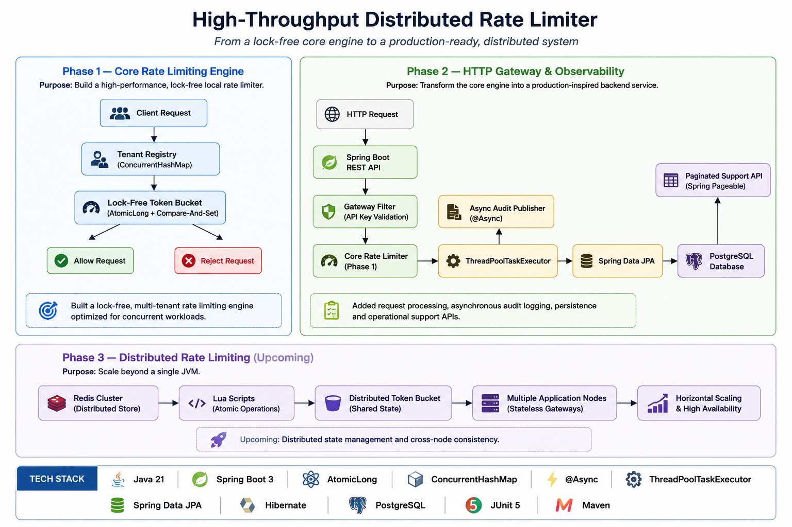

# High-Throughput Distributed Rate Limiter

A distributed rate limiter built from scratch using **Java 21** and **Spring Boot 3**,
designed to explore high-performance concurrency, multi-tenant isolation, asynchronous
observability pipelines, and scalable backend system design.

Built incrementally across three phases — each phase solving a real production problem,
not just adding features.

---

## 📌 Project Status

| Phase | Description | Status |
|-------|-------------|--------|
| ✅ Phase 1 | Local Concurrency Engine | Complete |
| ✅ Phase 2 | HTTP Gateway & Observability | Complete |
| 🚧 Phase 3 | Redis + Distributed Rate Limiting | In Progress |

---

## 🧠 Why I Built This

**Phase 1 problem:** How much does lock contention actually cost at scale?
Most engineers say "avoid synchronized" without measuring the real delta.
I implemented the same rate limiter three ways and benchmarked each one.

**Phase 2 problem:** Most rate limiters are black boxes.
When a customer says "your API blocked me unfairly" — you have zero evidence.
No logs, no trail, nothing to investigate. I built the fix.

**Phase 3 problem (in progress):** A rate limiter running on one server breaks
under a load balancer. Two nodes means two separate counter sets — same tenant
effectively gets 2× the limit. Redis fixes this.

---

## 🏛 System Architecture



---

## ✨ Features

### Phase 1 — Core Concurrency Engine
- Token Bucket with lazy refill (no background scheduler, preserves cache locality)
- `synchronized` baseline implementation
- Lock-Free CAS engine (`AtomicLong.compareAndSet()`)
- Multi-tenant registry (`ConcurrentHashMap` with TTL eviction)
- High-concurrency benchmarking (CountDownLatch starting pistol)
- Asymmetric chaos testing (noisy neighbor simulation)

### Phase 2 — HTTP Gateway & Observability
- Custom `OncePerRequestFilter` — intercepts at perimeter before Spring processing
- Tenant identity extraction: X-API-KEY → X-Forwarded-For → RemoteAddr fallback
- Proxy chain validation and header spoofing protection
- Async audit pipeline (`@Async` + `ApplicationEventPublisher`)
- Bounded `ThreadPoolTaskExecutor` (queue: 10,000, policy: DiscardPolicy)
- Every decision (allowed AND throttled) logged to PostgreSQL
- Paginated query API: filter by tenant, time window, decision type
- Composite index on `(tenant_id, timestamp)` for sub-millisecond lookups
- Profile-separated testing: H2 for tests, PostgreSQL for production

---

## 📊 Performance Benchmarks

### Phase 1 — Concurrency Comparison

| Implementation | Threads | Requests | Time | Throughput |
|----------------|--------:|---------:|-----:|-----------:|
| `synchronized` baseline | 100 | 100,000 | 14ms | **7,142,857 RPS** |
| Lock-Free CAS | 5,000 | 500,000 | 1,207ms | **414,250 RPS** |
| Lock-Free CAS | 10,000 | 1,000,000 | 2,756ms | **362,844 RPS** |

> **Key insight:** The synchronized baseline appears faster in isolation because it runs
> on 100 threads with no network overhead. The CAS engine is designed for sustained
> throughput under real distributed load — the meaningful comparison is latency under
> contention, not raw single-node RPS.

---

## 🔥 Chaos Testing — Noisy Neighbor Simulation

One tenant generated **80% of all traffic** to simulate real SaaS abuse conditions.
The goal was not maximum throughput — it was proving tenant isolation holds under attack.


| Metric | Value |
|--------|------:|
| Total Time | 2,434 ms |
| Abuser Requests | 8,026 |
| Normal Requests | 1,974 |
| Throughput | **4,108 RPS** |

Despite sustained abuse from one tenant, normal tenants continued receiving fair service.
The `ConcurrentHashMap` registry ensures per-tenant bucket isolation — one bucket's
depletion has zero effect on any other tenant's token count.

---

## 🔍 Observability — Phase 2

Every rate limit decision generates a Spring `ApplicationEvent`, consumed
asynchronously by `AuditLogListener` on a bounded thread pool.

```
Request
  ↓
RateLimitFilter (perimeter, ~0.1ms)
  ↓
TenantRegistry → TokenBucket
  ↓                    ↓
ALLOWED             THROTTLED (429)
  ↓                    ↓
  └────── Event Published (both paths) ──────┘
                        ↓
           ThreadPoolTaskExecutor (async)
           core=10, max=50, queue=10,000
                        ↓
           AuditLogListener (@Async)
                        ↓
           PostgreSQL — audit_logs table
           Index: (tenant_id, timestamp)
                        ↓
           GET /admin/audit-logs
           ?tenantId=X&from=Y&to=Z&decision=THROTTLED
```

Support teams can now answer:
> *"Why was tenant X blocked at 2:47pm yesterday on /api/data?"*

With a paginated, indexed, timestamped audit trail. Not guesses.

---

## ⚙️ Tech Stack

| Category | Technology |
|----------|------------|
| Language | Java 21 |
| Framework | Spring Boot 3.2.5 |
| Production Database | PostgreSQL 16 |
| Test Database | H2 (in-memory) |
| Persistence | Spring Data JPA, Hibernate 6 |
| Concurrency | `AtomicLong`, `ConcurrentHashMap` |
| Async Processing | `@Async`, `ThreadPoolTaskExecutor` |
| Testing | JUnit 5, Mockito, Spring Boot Test |
| Build | Maven |

---

## 🧪 Test Strategy

| Test Type | Annotation | What It Proves |
|-----------|------------|----------------|
| Unit | `@Test` | TokenBucket math correctness |
| Web Layer | `@WebMvcTest` | Filter interception and 429 responses |
| Repository | `@DataJpaTest` | Schema, index, insert, paginated query |
| Integration | `@SpringBootTest` | Full async pipeline end to end |
| Chaos | `CountDownLatch` | Tenant isolation under 80% abuse load |

**Phase 2 test results (on main branch):**
```
Tests run: 6, Failures: 0, Errors: 0, Skipped: 0
BUILD SUCCESS
```

---

## 🚀 Getting Started

### Prerequisites
- Java 21+
- Maven 3.8+
- PostgreSQL 16 (for production run)

### Clone

```bash
git clone https://github.com/hrithik-balakrishnan/rate-limiter.git
cd rate-limiter
```

### Run Tests (uses H2, no PostgreSQL needed)

```bash
mvn clean test
```

### Run Application (requires PostgreSQL)

Create the database first:
```sql
CREATE DATABASE ratelimiter;
```

Then run:
```bash
mvn spring-boot:run
```

### Query the Audit Log

```bash
GET /admin/audit-logs?tenantId=your-api-key&page=0&size=20
```

---

## 📅 Roadmap

### ✅ Phase 1 — Local Concurrency Engine
- [x] Lazy-refill Token Bucket with `nanoTime` precision
- [x] `synchronized` baseline (7,142,857 RPS at 100 threads)
- [x] Lock-Free CAS migration (414,250 RPS at 5,000 threads)
- [x] Multi-tenant `ConcurrentHashMap` registry with TTL eviction
- [x] Asymmetric chaos test — noisy neighbor at 80% load

### ✅ Phase 2 — HTTP Gateway & Observability
- [x] `OncePerRequestFilter` at request perimeter
- [x] Tenant identity: API key → X-Forwarded-For → IP fallback
- [x] Async audit pipeline with bounded executor
- [x] PostgreSQL persistence with batch inserts
- [x] Paginated query API with composite index
- [x] Profile-separated testing (H2 / PostgreSQL)

### 🚧 Phase 3 — Distributed Rate Limiting
- [ ] Redis cluster integration
- [ ] Atomic Lua scripts (distributed CAS equivalent)
- [ ] Sliding window with Redis Sorted Sets
- [ ] Multi-tenant key namespace with hot-key sharding
- [ ] Circuit breaker with in-memory fallback
- [ ] k6 load test targeting ≥10,000 RPS at P95 < 2ms

---

## 👨‍💻 Author

**Hrithik B**

- GitHub: [github.com/hrithik-balakrishnan](https://github.com/hrithik-balakrishnan)
- LinkedIn: [linkedin.com/in/hrithik-b-a45865319](https://www.linkedin.com/in/hrithik-b-a45865319)
