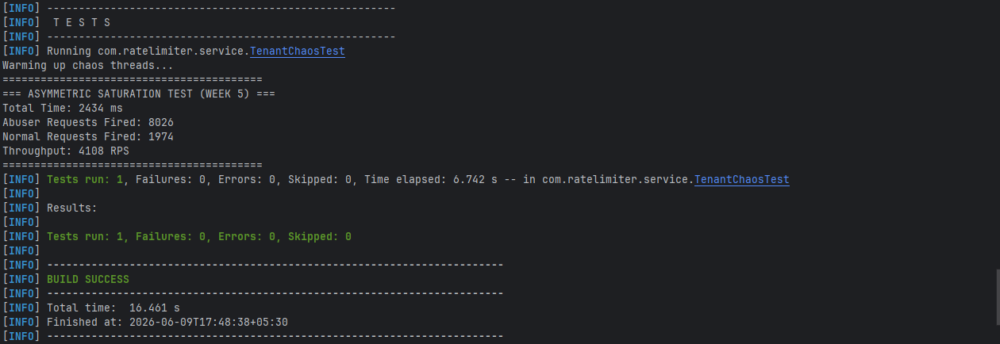

# High-Throughput Distributed Rate Limiter

A distributed rate limiter built from scratch using **Java 21** and **Spring Boot 3** to explore high-performance concurrency, multi-tenant isolation, asynchronous processing, and scalable backend system design.

The project is being developed incrementally across multiple phases, with each phase introducing production-inspired backend engineering concepts.

---

# 📌 Project Status

| Phase | Status |
|--------|--------|
| ✅ Phase 1 – Local Concurrency Engine | Complete |
| ✅ Phase 2 – HTTP Gateway & Observability | Complete |
| 🚧 Phase 3 – Redis + Distributed Rate Limiting | In Progress |

---

# ✨ Features

## Phase 1
- Token Bucket Rate Limiter
- Lock-Free CAS Engine (`AtomicLong`)
- Multi-Tenant Rate Limiting
- `ConcurrentHashMap` Tenant Registry
- High-Concurrency Benchmarking
- Chaos Testing

## Phase 2
- Spring Boot REST API
- Request Filtering & API Key Validation
- Asynchronous Audit Logging (`@Async`)
- PostgreSQL Persistence
- Hibernate JDBC Batch Inserts
- Paginated Audit APIs
- Layered Spring Boot Testing
- H2 Integration Testing

---

# 🏛 System Architecture

```text
                        Client
                           │
                           ▼
                  HTTP Request (API Key)
                           │
                           ▼
                 Spring Boot REST API
                           │
                           ▼
                 Gateway Security Layer
                           │
                           ▼
                Tenant Registry Service
             (ConcurrentHashMap Registry)
                           │
                           ▼
                Lock-Free Token Bucket
                  (CAS Rate Limiter)
                 /                    \
                /                      \
       Request Allowed          Request Rejected
                │                      │
                └──────────┬───────────┘
                           ▼
                 Async Audit Publisher
                      (@Async Event)
                           │
                           ▼
                ThreadPoolTaskExecutor
                           │
                           ▼
                 Spring Data JPA Layer
                           │
                           ▼
                    PostgreSQL Database
```

---

# 📊 Performance Benchmarks

| Implementation | Threads | Throughput |
|----------------|---------:|-----------:|
| Token Bucket (`synchronized`) | 100 | 140,845 RPS |
| Lock-Free CAS Engine | 5,000 | **414,250 RPS** |

The lock-free implementation replaces intrinsic locks with optimistic atomic updates using `AtomicLong.compareAndSet()`, significantly improving scalability under concurrent workloads.

---

# 🔥 Chaos Testing (Noisy Neighbor Simulation)

A real-world multi-tenant workload was simulated where one tenant generated approximately **80% of all incoming traffic**.

| Metric | Value |
|--------|------:|
| Abuser Requests | 8,026 |
| Normal Requests | 1,974 |
| Throughput | **4,108 RPS** |

The objective was not maximum throughput but validating **tenant isolation under contention**. Despite sustained abuse from one tenant, normal tenants continued to receive fair service.



---

# ⚙️ Tech Stack

| Category | Technology |
|----------|------------|
| Language | Java 21 |
| Framework | Spring Boot 3 |
| Database | PostgreSQL |
| Testing Database | H2 |
| Persistence | Spring Data JPA, Hibernate |
| Concurrency | AtomicLong, ConcurrentHashMap |
| Async Processing | `@Async`, ThreadPoolTaskExecutor |
| Testing | JUnit 5, Mockito, Spring Boot Test |
| Build Tool | Maven |

---

# 🧪 Test Strategy

The project includes automated testing across multiple layers.

- Unit Tests
- Web Layer Tests (`@WebMvcTest`)
- Repository Tests (`@DataJpaTest`)
- Integration Tests (`@SpringBootTest`)
- H2 In-Memory Database Testing

---

# 🚀 Getting Started

## Clone

```bash
https://github.com/hrithik-balakrishnan/rate-limiter.git
```

## Run

```bash
mvn spring-boot:run
```

## Execute Tests

```bash
mvn test
```

---

# 📅 Roadmap

### ✅ Phase 1
- Token Bucket
- Lock-Free CAS
- Multi-Tenant Registry
- Chaos Testing

### ✅ Phase 2
- HTTP Gateway
- Async Audit Pipeline
- PostgreSQL Persistence
- Pagination APIs

### 🚧 Phase 3
- Redis Cluster
- Lua Scripts
- Distributed Rate Limiting
- Cross-Node Consistency
- Horizontal Scaling

---

# 👨‍💻 Author

**Hrithik B**

- GitHub: https://github.com/hrithik-balakrishnan
- LinkedIn: https://www.linkedin.com/in/hrithik-b-a45865319